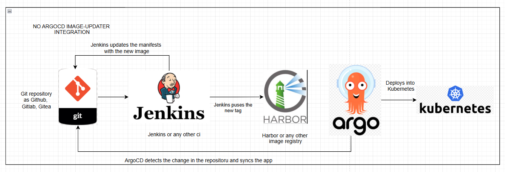
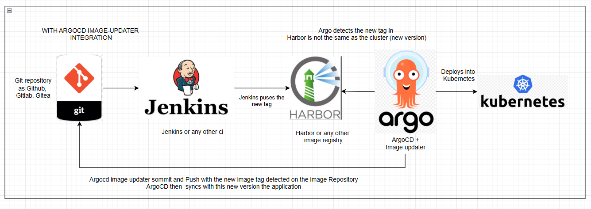

# Preparing Argo CD Image Updater with Harbor and Gitea (No SSL)
## IF YOU DONT use a private  ssl harbor registry and gitea repository, skip 1,2,3 and 6.

# WITHOUD ARGOCD IMAGE UDPATER :(


# WITH ARGOCD IMAGE UPDATER :)


## **1. Create Secrets**
### **Applicationnamespaces for the two enamespaces**
```bash
kubectl create secret docker-registry harbor-credentials \
  --docker-server=core.harbor.domain \
  --docker-username=admin \
  --docker-password=Harbor12345 \
  --docker-email=your_email@example.com \
  -n testapp-prod

kubectl create secret docker-registry harbor-credentials \
  --docker-server=core.harbor.domain \
  --docker-username=admin \
  --docker-password=Harbor12345 \
  --docker-email=your_email@example.com \
  -n testapp-dev
```

### **Namespace `argocd`**
```bash
kubectl create -n argocd secret docker-registry harbor-secret \
  --docker-username=admin \
  --docker-password=Harbor12345 \
  --docker-server="http://core.harbor.domain"
```

---

## **1.5. Add to `/etc/hosts`**
Include the private registry's domain in `/etc/hosts` on nodes to ensure `kubelet` can resolve the image sources.

---

## **2. Register Harbor as Insecure in K3s**
Follow the [K3s documentation](https://docs.k3s.io/installation/private-registry) to set up the insecure registry configuration.

---

## **3. Register Harbor as Insecure in Docker Desktop**
Edit your `daemon.json` file:
```json
{
  "builder": {
    "gc": {
      "defaultKeepStorage": "20GB",
      "enabled": true
    }
  },
  "experimental": false,
  "insecure-registries": [
    "core.harbor.domain"
  ]
}
```

---

## **4. Build and Push an Image**
```bash
docker build -t core.harbor.domain/test/test-app:0.0.1 .
docker push core.harbor.domain/test/test-app:0.0.1
```

---

## **5. Configure Argo CD Image Updater of values.yaml**
In the Image Updater `values.yaml` file (this si all what you need to change in the values.yaml):
```yaml
data:
  registries: 
    - name: Harbor
      api_url: http://core.harbor.domain
      defaultns: test
      credentials: pullsecret:argocd/harbor-secret 
      prefix: core.harbor.domain
      insecure: true
```

---

## **6. Configure Git as Untrusted**
```bash
export GIT_SSL_NO_VERIFY=true
```

---

## **7. Recommended Annotations in `Application`**
```yaml
annotations:
  argocd-image-updater.argoproj.io/image-list: "testapp=core.harbor.domain/test/test-app:~0.0.1,testapp2=core.harbor.domain/test/test-app2:~0.0.1"
  argocd-image-updater.argoproj.io/write-back-method: git
  argocd-image-updater.argoproj.io/write-back-target: kustomization
  argocd-image-updater.argoproj.io/git-branch: main
```