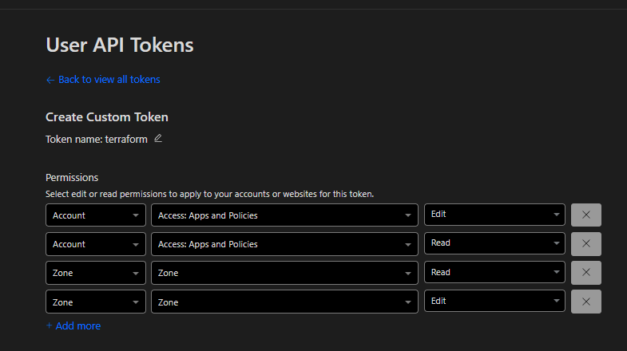

# Expose An APP(wordpress) via Cloudflare Tunnel Ingress from your ON PREM enviroment In KUBERNETES

This demo shows how to expose WordPress in Kubernetes using the [Cloudflare Tunnel Ingress Controller](https://github.com/STRRL/cloudflare-tunnel-ingress-controller).

---

## REQUIEREMENTS
  - A kubernetes cluster
  - A cloudflare account and a domain (zone registeed)
  - Some cloudflare knowledge

## Setup the Tunnel Controller in the Cluster

Follow the instructions in the original repo to setup de app (they are covered in the video):
  https://github.com/STRRL/cloudflare-tunnel-ingress-controller

---

## Deploy WordPress with Ingress
  The networking things

```bash
helm upgrade --install --wait \
  -n wordpress --create-namespace wordpress \
  oci://registry-1.docker.io/bitnamicharts/wordpress \
  --set=ingress.enabled=true \
  --set=ingress.ingressClassName="cloudflare-tunnel" \
  --set=ingress.hostname="your_subdomain.your_domain.com"
````

---

##  Protect with Zero Trust the domain before created with Terraform (just to make it easier)

1. Create an API token at [Cloudflare Dashboard](https://dash.cloudflare.com/profile/api-tokens) and gitve the following permissions.


2. Set your token:

   ```bash
   export CLOUDFLARE_API_TOKEN=your_api_token
   ```
3. Edit `vars.tf` with your account_id, zone.. 
4. Deploy:

   ```bash
   cd tf
   terraform init
   terraform apply
   ```


### PENDING THINGS 
  - As this is a community ingress done someathing may change frequently, there is an issue with things that may change.
---
